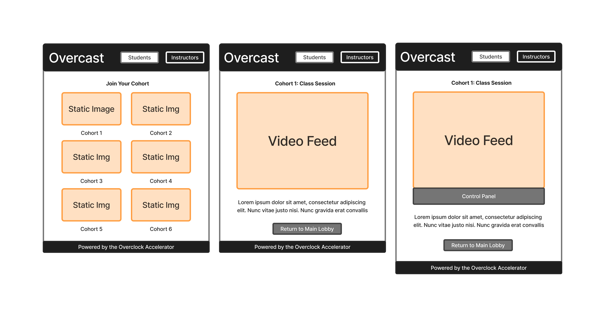

# Overcast - Video Classroom Platform

A modern, real-time video classroom application powered by Daily.co, designed for the Overclock Accelerator.



## 🎯 Features

### Core Functionality
- **Lobby Interface**: Browse and join 6 live classroom sessions
- **Live Video Streaming**: Real-time video and audio broadcasting for all participants
- **Dual Mode Access**: 
  - **Student Mode**: Join classrooms, broadcast audio/video, switch between sessions
  - **Instructor Mode**: Full classroom management with control panel
- **Capacity Management**: 15-participant limit per classroom with real-time capacity display
- **Flexible Navigation**: Return to lobby and switch classrooms at any time

### Instructor Features
- **Participant Management**: View all active participants with audio status
- **Mute Controls**: 
  - Mute/unmute individual participants
  - Bulk mute/unmute all participants
- **Breakout Rooms**: 
  - Create 2-6 separate video sessions
  - Assign participants manually or auto-assign
  - Complete audio/video isolation between rooms
  - Monitor and join any breakout room

## 🚀 Quick Start

### Prerequisites
- Node.js 18+ 
- npm or yarn
- Daily.co account (free tier available)

### Installation

1. **Clone the repository**
```bash
cd /Users/razashareef/Documents/OverClock\ Work/overcast
```

2. **Install dependencies**
```bash
npm install
```

3. **Set up Daily.co rooms**
   - Create a free account at [daily.co](https://daily.co)
   - Create 6 rooms in your Daily dashboard
   - Copy the room URLs

4. **Configure classroom URLs**

Edit `/config/classrooms.ts` and replace the placeholder URLs with your actual Daily.co room URLs:

```typescript
export const CLASSROOMS: Classroom[] = [
  {
    id: 1,
    name: "Cohort 1",
    roomUrl: "https://YOUR-DOMAIN.daily.co/cohort-1", // Replace with your URL
    maxCapacity: 15,
    status: ClassroomStatus.NOT_STARTED
  },
  // ... repeat for 6 classrooms
];
```

5. **Run the development server**
```bash
npm run dev
```

6. **Open in browser**
```
http://localhost:3000
```

## 📁 Project Structure

```
overcast/
├── app/
│   ├── components/
│   │   ├── Header.tsx              # Navigation header with mode toggle
│   │   ├── Footer.tsx              # Footer with Overclock branding
│   │   ├── ClassroomCard.tsx       # Lobby classroom display cards
│   │   ├── NameEntryModal.tsx      # User name input modal
│   │   ├── VideoRoom.tsx           # Daily.co provider setup
│   │   ├── VideoGrid.tsx           # Participant video grid
│   │   ├── VideoTile.tsx           # Individual participant video tile
│   │   ├── ControlPanel.tsx        # Instructor control panel
│   │   ├── ParticipantsTab.tsx     # Participant management UI
│   │   └── BreakoutRoomsTab.tsx    # Breakout rooms configuration
│   ├── classroom/[id]/
│   │   └── page.tsx                # Dynamic classroom page
│   ├── page.tsx                    # Lobby page
│   ├── layout.tsx                  # Root layout with providers
│   ├── providers.tsx               # Jotai state provider
│   └── globals.css                 # Global styles with Overclock theme
├── types/
│   ├── classroom.ts                # Classroom data types
│   ├── user.ts                     # User and mode types
│   ├── session.ts                  # Video session types
│   └── breakout.ts                 # Breakout room types
├── config/
│   └── classrooms.ts               # Classroom configuration
├── lib/
│   ├── atoms.ts                    # Jotai state atoms
│   └── storage.ts                  # LocalStorage utilities
├── specs/
│   └── 001-video-classroom-app/    # Feature specification docs
│       ├── spec.md                 # Product requirements
│       ├── research.md             # Technology decisions
│       ├── data-model.md           # Data architecture
│       └── implementation-plan.md  # Development roadmap
└── README.md
```

## 🎨 Visual Design

Overcast follows the **Overclock Accelerator** visual identity:

### Color Palette
- **Deep Black** (`#000000`): Primary background
- **Neon Teal** (`#00FFD1`): CTAs, highlights, active states
- **Accent Orange** (`#FFBD17`): Urgency indicators, warnings
- **Soft Gray** (`#E5E5E5`): Primary text
- **Medium Gray** (`#808080`): Secondary text, borders

### Typography
- **Font**: Geist Sans (geometric, modern)
- **Headers**: Bold, uppercase, tracking-wide
- **Body**: Clean, high contrast for readability

### Design Principles
- Futuristic, minimalistic aesthetic
- High contrast for clarity
- Ample negative space
- Card-based layouts
- Smooth transitions and hover states

## 🔧 Technology Stack

| Component | Technology |
|-----------|-----------|
| Framework | Next.js 16 (App Router) |
| Language | TypeScript 5 |
| Video Platform | Daily.co |
| React Library | @daily-co/daily-react |
| State Management | Jotai |
| Styling | Tailwind CSS 4 |
| Deployment | Vercel (ready) |

## 🎮 Usage Guide

### For Students

1. **Access the Lobby**: Open the application to see 6 available classrooms
2. **Check Capacity**: View real-time participant counts (e.g., "8/15")
3. **Enter Your Name**: First-time users prompted for display name
4. **Join Classroom**: Click "Join Classroom" on any available room
5. **Broadcast**: Your audio/video automatically broadcasts to other participants
6. **Switch Rooms**: Click "Return to Lobby" to join a different classroom

### For Instructors

1. **Enable Instructor Mode**: Click "Instructors" toggle in header
2. **Join Classroom**: Click "Enter as Instructor" on any classroom
3. **Access Control Panel**: View instructor controls below video grid
4. **Manage Participants**:
   - View all participants with audio status
   - Mute/unmute individual participants
   - Use "Mute All" / "Unmute All" for bulk actions
5. **Create Breakout Rooms**:
   - Switch to "Breakout Rooms" tab
   - Select number of rooms (2-6)
   - Assign participants (manually or auto-assign)
   - Start breakout session
   - End breakout to return all to main room

## 📝 Configuration

### Daily.co Room Setup

**Option 1: Dashboard (Recommended for MVP)**
1. Go to [daily.co/dashboard](https://dashboard.daily.co/rooms)
2. Create 6 rooms
3. Copy room URLs to `/config/classrooms.ts`

**Option 2: API (For Production)**
```javascript
// Create rooms programmatically
const response = await fetch('https://api.daily.co/v1/rooms', {
  method: 'POST',
  headers: {
    'Authorization': 'Bearer YOUR_API_KEY',
    'Content-Type': 'application/json'
  },
  body: JSON.stringify({
    name: 'cohort-1',
    properties: {
      max_participants: 15
    }
  })
});
```

### Environment Variables (Optional)

Create `.env.local` for production features:

```env
# Daily.co API Key (for programmatic room creation)
DAILY_API_KEY=your_daily_api_key_here

# Daily.co Domain
NEXT_PUBLIC_DAILY_DOMAIN=your-domain.daily.co
```

## 🚢 Deployment

### Deploy to Vercel

1. **Push to GitHub**
```bash
git init
git add .
git commit -m "Initial Overcast implementation"
git remote add origin your-repo-url
git push -u origin main
```

2. **Connect to Vercel**
   - Go to [vercel.com](https://vercel.com)
   - Import your GitHub repository
   - Vercel auto-detects Next.js configuration

3. **Add Environment Variables** (if using API key)
   - In Vercel dashboard → Settings → Environment Variables
   - Add `DAILY_API_KEY` and any other secrets

4. **Deploy**
   - Automatic deployments on every push to `main`
   - Preview deployments for pull requests

## 🧪 Testing

### Manual Testing Checklist

**Student Flow (P1)**
- [ ] Lobby displays 6 classrooms
- [ ] Name entry modal appears on first join
- [ ] Can join classroom and see video feed
- [ ] Name displayed to other participants
- [ ] Audio/video broadcasts correctly
- [ ] Can return to lobby
- [ ] Can switch to different classroom
- [ ] Room full prevents joining

**Instructor Flow (P2)**
- [ ] Instructor toggle works
- [ ] Control panel appears in classroom
- [ ] Can see participant list
- [ ] Can mute individual participant
- [ ] Can unmute participant
- [ ] Mute All / Unmute All works
- [ ] Returns to lobby in instructor mode

**Breakout Rooms (P3)**
- [ ] Can configure number of rooms
- [ ] Can assign participants manually
- [ ] Auto-assign distributes evenly
- [ ] Start breakout initiates UI (Daily Enterprise needed for full function)
- [ ] End breakout returns to main session

### Multi-User Testing

Test with 2+ browser windows (or devices):

1. Open incognito/private windows
2. Join same classroom with different names
3. Verify all participants see each other
4. Test instructor controls from one window
5. Verify mute actions affect other windows

## 🐛 Troubleshooting

### "Failed to join room" Error
- **Cause**: Invalid Daily.co room URL
- **Solution**: Check `/config/classrooms.ts` URLs are correct and rooms exist

### Video Not Showing
- **Cause**: Browser camera/microphone permissions denied
- **Solution**: Allow camera/mic permissions when prompted

### "Room Full" When Not Full
- **Cause**: Room capacity reporting delay
- **Solution**: Refresh page, or check actual participant count in Daily dashboard

### Breakout Rooms "Enterprise Required"
- **Cause**: Breakout rooms require Daily.co Enterprise plan
- **Solution**: UI demo works, full functionality requires plan upgrade

## 📚 Documentation

- [Feature Specification](./specs/001-video-classroom-app/spec.md)
- [Research & Decisions](./specs/001-video-classroom-app/research.md)
- [Data Model](./specs/001-video-classroom-app/data-model.md)
- [Implementation Plan](./specs/001-video-classroom-app/implementation-plan.md)
- [Daily.co Documentation](https://docs.daily.co)
- [Daily React Hooks](https://docs.daily.co/reference/daily-react)

## 🤝 Contributing

This is an Overclock Accelerator internal project. For questions or improvements:

1. Review the spec documents in `/specs/001-video-classroom-app/`
2. Follow the existing code style (TypeScript strict mode, Tailwind utilities)
3. Test all user flows before committing
4. Update documentation for new features

## 📄 License

Proprietary - Overclock Accelerator

---

**Built with** ⚡️ **by the Overclock Team**

For support, contact: [support@overclock.com](mailto:support@overclock.com)
